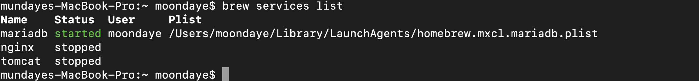
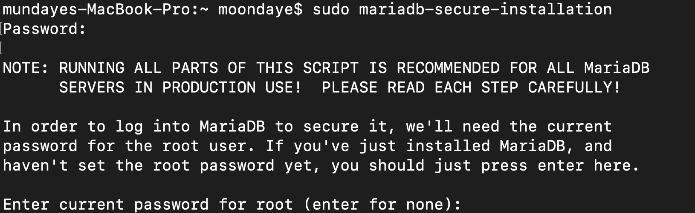

# Homebrew로 macOS에 MariaDB Server 설치

[Homebrew](http://brew.sh/) 패키지 매니저를 이용해서 MariaDB Server를 macOS (이전 Mac OS X) 설치할 수 있습니다.

MariaDB Server는 미리 컴파일된 Homebrew "bottle" 패키지로 이용 가능하며, 소스 빌드가 필요 없어 시간을 절약해줄 수 있습니다.

Homebrew 설치 후에는 MariaDB Server 는 다음과 같이 설치 가능합니다.

```
brew install mariadb
```

설치 후에는 다음으로 MariaDB Server를 시작합니다.:

```
mysql.server start
```

MariaDB Server 자동 시작하려면 다음과 같이 Homebrew 서비스 기능을 이용할 수 있습니다. (이 서비스 기능은 [launchd](https://mariadb.com/kb/en/launchd/) 의 launchctl 유틸리티를 이용합니다) :

```
brew services start mariadb
```

MariaDB Server 시작후에는 사용자 계정으로 로그인하면 됩니다.:

```
mysql
```

또는 루트 계정으로 로그인할 수도 있습니다.:

```
sudo mysql -u root
```

## MariaDB 업그레이드

우선 brew 를 업데이트 합니다.

```
brew update
```

그리고, 다음과 같이 MariaDB Server를 업데이트 합니다. :

```
brew upgrade mariadb
```

## 소스로부터 MariaDB Server 빌드

"bottled" MariaDB Server 패키지는 Homebrew로도 가능하지만 소스로부터 MariaDB를 빌드할 수도 있습니다. 이는 bottle 패키지에 포함되지 않은 다른 버전의 특징적인 기능들을 사용하고자 할때 유용합니다.

bottle 패키지에 포함되지 않은 두 개의 컴퓨넌트들은 CONNECT와 OQGRAPH 엔진인데, 이는 비표준 의존성을 가지고 있기 떄문입니다. 이 엔진으로 MariaDB Server 를 빌드하려면 우선, `boost` 와 `judy`를 설치해야 합니다. 2016년 12월 현재, judy는 Homebrew "boneyard" 단계이나 macOS Sierra 상에서 동작합니다. 의존성을 가진 상태로 서버를 빌드 및 설치하려면 다음 단계를 따라주세요.:

```
brew install boost homebrew/boneyard/judy
brew install mariadb --build-from-source
```

또한 Homebrew를 이용하여 MariaDB Server의 프리-릴리즈 버전을 빌드 및 설치할 수 있습니다 (예를 들어, MariaDB Server 10.2, MariaDB Server 10.1의 가장 최신의 GA 버전). MariaDB Server 의 "개발" 버전을 빌드 및 설치하려면 다음과 같이 합니다.:

```
brew install mariadb --devel
```


# 1. MariaDB install in Mac

맥북 유저라면 애용하게 되는 homebrew를 이용하여 설치했다.

```
brew install mariadb
```

homebrew가 업데이트가 되고~ mariadb가 깔끔하게 설치가 된다
(필자는 sudo 패스워드를 mariadb 초기 패스워드로 착각하여 몇번 uninstall 했었다는....)

설치가 완료되었다면 실행시켜보자
brew로 설치한 서비스들을 시작할때는 아래와 같은 구문을 쓰도록 하자

동작 : `brew services start mariadb`
중지 : `brew services stop mariadb`

mariadb를 동작시켰다면 실제로 동작하는지 확인!!

```
brew services list
```

그럼 brew로 설치된 서비스들의 동작 여부를 확인할 수 있을 것이다


# 2. MariaDB root 계정 생성

Mysql과 마찬가지로 MariaDB도 설치하였다면 관리자 계정인 root 계정을 설정해야한다.

```
sudo mariadb-secure-installation
```

sudo를 이용해 진입하면 sudo 패스워드를 입력해야한다. (필자는 이 곳에서 당황하여 2시간 잡아먹은듯 하다 ㅠㅠ)

### 1. 초기 root 계정의 비밀번호를 요구하는 Current Password가 있을텐데 여기선 Enter로 넘어가도 된다



### 2. mariadb setting이 이루어질텐데, 아래와 같이 설정하면 무방할듯

(추후에 dbeaver와 연동할때 권한 열어둘걸...)

> 중간에 패스워드 설정해주고 쭉 나아가면 된다.(패스워드 잊지 말아라!)

OK, successfully used password, moving on...

Setting the root password or using the unix_socket ensures that nobody
can log into the MariaDB root user without the proper authorisation.

You already have your root account protected, so you can safely answer 'n'.

**Switch to unix_socket authentication [Y/n] n**
... skipping.

You already have your root account protected, so you can safely answer 'n'.

**Change the root password? [Y/n] y**
New password:
Re-enter new password:
Password updated successfully!
Reloading privilege tables..
... Success!

By default, a MariaDB installation has an anonymous user, allowing anyone
to log into MariaDB without having to have a user account created for
them. This is intended only for testing, and to make the installation
go a bit smoother. You should remove them before moving into a
production environment.

**Remove anonymous users? [Y/n] y**
... Success!

Normally, root should only be allowed to connect from 'localhost'. This
ensures that someone cannot guess at the root password from the network.

**Disallow root login remotely? [Y/n] n**
... skipping.

By default, MariaDB comes with a database named 'test' that anyone can
access. This is also intended only for testing, and should be removed
before moving into a production environment.

**Remove test database and access to it? [Y/n] y**

- Dropping test database...
  ... Success!
- Removing privileges on test database...
  ... Success!

Reloading the privilege tables will ensure that all changes made so far
will take effect immediately.

**Reload privilege tables now? [Y/n] y**
... Success!

Cleaning up...

All done! If you've completed all of the above steps, your MariaDB
installation should now be secure.

Thanks for using MariaDB!

### 3. mariadb root 계정에 접속

```
mysql -u root -p
```

위 내용을 작성하고 설정해준 패스워드를 쳐주면
mariadb 입성 성공!

참고로, mariadb는 mysql의 브랜치에서 뻗어나온 것이므로 mysql의 문법과 동일하다고 보면 된다.
쿼리를 작성하기 전에

`use mysql` 을 이용하면 mysql 문법으로 쿼리 작성이 가능하다!

필자는 mysql 문법만 공부해서 너무나도 찰떡인 db문을 만난것 같아 기쁘다 ㅎㅎ